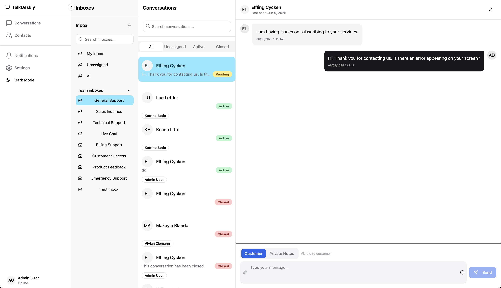

# TalkDeskly

Modern, real-time chat application with embeddable components. Built for scalability and seamless integration.

TalkDeskly is a single-binary application built with Go and React.

Visit [talkdeskly.com](https://talkdeskly.com) for more info. Check out the [**Live demo**](https://demo.talkdeskly.com/).

> **CAUTION:** This project is currently in **development**. Features and APIs may change and are not yet fully tested.

## Features

- **Multi Channel Support**  
  Support for multiple communication channels. Currently live chat is available with more channels coming soon.
- **Admin/Agent Roles**  
  Role-based access control with distinct permissions for administrators and support agents.
- **Internationalization Support**  
  Multi-language support for global customer support teams and customers.
- **Canned Responses**  
  Save frequently used messages as templates for quick and consistent customer responses.
- **Live Chat SDK**  
  Easy-to-integrate SDK for embedding live chat functionality into any web application.
- **Audit System**  
  Complete activity tracking and logging for compliance, accountability, and performance monitoring.
- **Live Chat Widget Customization**  
  Fully customizable chat widget to match your brand colors, styling, and user experience.
- **Auto Assignments**  
  Intelligent conversation routing and automatic assignment to available agents based on custom rules.
- **Out of Hours Message**  
  Automated responses for customers contacting support outside business hours.
- **Pre-Chat Form**  
  Customizable forms to collect customer information before starting a chat session.
